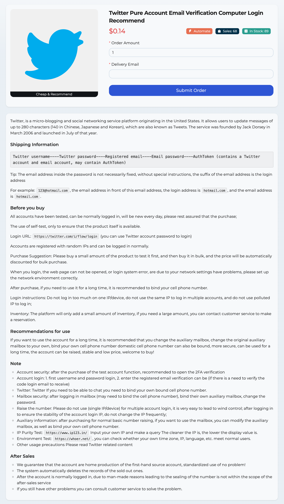

# 2024 Latest Free Twitter X Pure Account Email Verification Computer Login Recommend

Website: [https://allshop.vip](https://allshop.vip/?_referrer=ghkdmmz92)



Twitter, is a micro-blogging and social networking service platform originating in the United States. It allows users to update messages of up to 280 characters (140 in Chinese, Japanese and Korean), which are also known as Tweets. The service was founded by Jack Dorsey in March 2006 and launched in July of that year.

##### Shipping Information

```
Twitter username----Twitter password----Registered email----Email password----AuthToken (contains a Twitter account and email account, may contain AuthToken)
```

Tip: The email address inside the password is not necessarily fixed, without special instructions, the suffix of the email address is the login address

For example: `123@hotmail.com`, the email address in front of this email address, the login address is `hotmail.com`, and the email address is `hotmail.com`.
